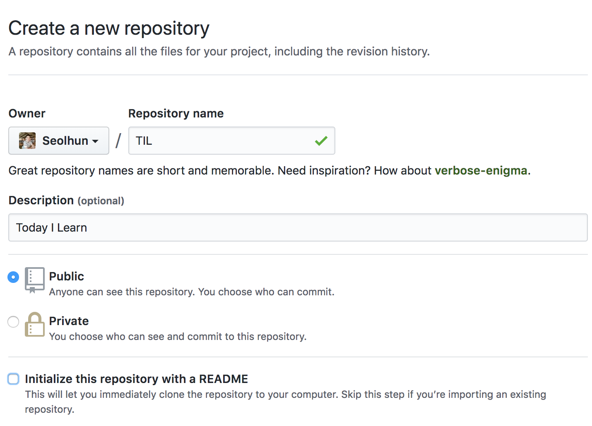

# Git Basic - Part1
이번 페이지에서는 Git에 간단한 Command를 이해하고 실습해보는 시간을 가져볼까 합니다.
실습내용으로는, 가장 기초적인 TIL Repository를 Github에 만들예정이며, 해당 Repository를 통해 앞으로 여러분이 학습하고 작성되는 코드를 잘 관리하기를 바랍니다.

해당 내용을 나아가기에 앞서, Git에서 알아야되는 기본적인 3가지 영역에 대해서 알아보겠습니다.
<div class='image'>
	
</div>


> 위 이미를 참고하여 **Git이 3가지 영역을 관리하고 있다는 것을 반드시 숙지하시기 바랍니다.**

1. Working Directory(Tree)
	- 작업이 이루어지는 공간이며, 깃이 항상 추적하고 있습니다.
2. Staging Area
	- Working Directory에서 Repository로 보내기 위해 추가(git add) 명령어를 받은 파일들이 대기하는 공간입니다.
3. (Local) Repository
	- Staging Area에서 Repository로 저장(git commit)되어 있는 공간입니다.

위 사항을 인지하였다면, 마지막으로 1가지 사항을 더 인지해야 합니다. `(Remote) Repository`입니다. Remote Repository를 하나의 물리적인 서버에서 각각의 Local Repository에 대한 내용을 통합하여 관리하는 것입니다.
현재는 Github와 같은 Cloud 서비스로 쉽게 접근/관리할 수 있습니다. 이와 같은 원격 Repository를 Remote Repository라 하며, 이를 포함한 총 4개의 영역을 숙지하셔야 합니다.

이제 4가지 영역을 머리속에 가지고 계신다면 이제, `init`, `add`, `commit`, `push`에 대해서 알아보겠습니다.

---
## Configuration
Git을 설치하고 나서 가장 먼저 해야 하는 것은 사용자 이름과 이메일 주소를 설정하는 것입니다. Git은 커밋할 때마다 이 정보를 사용하는데, 한번 커밋 후에는 커밋에 대한 해당 정보를 변경할 수 없습니다.

```bash
$ git config --global user.name "Seolhun"
$ git config --global user.email shun10114@gmail.com
$ git config --list
```

> 해당 name과 email은 github에 가입되었던 내용으로 입력해주시면 더 편리하게 작업할 수 있습니다.

---
## Init
해당 디렉토리에서 git의 tracking을 시작하겠다는 명령어입니다. 숨김 파일을 보면 `.git` 디렉토리가 생성됨을 알 수 있습니다.
> .git 디렉토리에는 git의 설정 및 작동되는 정보들에 대한 데이터가 관리됩니다. .git 디렉토리를 지우면 기존에 있던 Local Reository에 대한 모든 정보가 사라집니다.

```bash
$ mkdir ~/git
$ cd ~/git
$ mkdir TIL
$ git init
```

---
## Add
Working Tree에 관리되는 File을 Indexing하여 Staging Area에 올려 놓습니다. add된 file은 `git status`로 확인 할 수 있습니다.

```bash
$ echo > index.html "<h2>YourName</h2>"
$ git status
$ git add index.html
$ git status
```
<div class='image'>
	
</div>

> add 전후의 status 명령어를 통해 확인하면, 파일의 상태가 어떻게 변하였는지를 알 수 있습니다.

#### Tip - `*`와 `.`의 차이
> `add *`는 현재 디렉토리에 있는 모든 파일들(.으로 시작되는 파일명을 제외한)을 추가한다는 의미입니다. * 명령어는 linux shell의 명령어로 git은 파일 목록만 받는 것입니다.

> `add .`는 전체 디렉토리 파일 모두를 재귀적으로 추가합니다.(.으로 시작되는 파일명도 포함합니다.)

```bash
$ echo > .test "test"
$ git add *
$ git status
$ git add .
$ git status
```

---
## Commit
Staging Area에 올려진 파일들을 Local Repository로 이동시킵니다.

```bash
$ git add *
$ git commit -m "First Commit"
```
```bash
$ git commit -m "Message" -m "Description"
```

> -m은 message라는 약어입니다. commit에 대한 내용을 간단히 입력해주세요. 더 자세한 내용을 기록하고 싶으면 -m을 한번 더 사용하여 Description을 채워주세요.

---
## Push
Local Repository에 있는 File들을 Remote Repository로 전송합니다.

```bash
$ git push origin master
```
> origin은 remote repository와 연결된 주소의 이름입니다. origin이 default 값이며, 이를 본인 혹은 팀 규칙에 맞게 변경하여 사용할 수 있습니다.

아마 정상적으로 작동되지 않을 것입니다. 왜냐하면, 위에서 언급했듯이 기본적으로 Git에는 Remote Repository가 연결되지 않기 때문입니다. 어느 Remote Repository를 연결할지 개발자가 직접 지정해주어야 합니다. Github에 Remote Repository를 만들고 현재 Local Repository와 연결해봅시다.

---
## Remote Repository 만들기
#### 1. Git을 설치합니다.
- 맥은 [Homebrew](https://brew.sh/index_ko)
	- `brew install git`
- 윈도우는 [Git-Download](https://git-scm.com/downloads)

#### 2. GitHub를 가입합니다.
- 오픈소스에 세계에 오신것을 환영합니다.

#### 3. GitHub에 Remote Repository를 생성합니다.
- 녹색으로 보이는 `New` Button을 눌러줍니다.

<div class='image'>
	
</div>

- 아래를 참고하여 TIL Rpository를 만들어봅니다.
<div class='image'>
	
</div>

- 만들어진 Repositroy에 Path를 복사합시다.
<div class='image'>
	
</div>

#### 4. Local Repository에 Remote Repository를 연결합니다.
```bash
$ git remote -v
$ git remote add origin ${복사한 주소}
$ git remote -v
```

> 기본 Remote Repository에 기본이름은 `origin`으로 설정되어있습니다. 첫 연결 후 명령어를 제외하고는 origin은 default 값이므로
push나 pull 등에 remote repository와 작업 할 때 지정을 하지 않으면 기본적으로 origin을 바라보게 됩니다.


이제 TIL 폴더(Local Repository)와 Remote Repository가 연결되었으면 다시 한번 git push를 해봅니다.

```bash
$ git push origin master
```

Push가 정상적으로 작동되었으면, Github Remote Repository에 들어가서(복사한 주소) 정상적으로 반영이 되었는지 확인해봅시다. 정상적으로 들어갔다면 이번 미션을 잘 달성하셨습니다.

이상 기본적으로 Git Command에 대한 내용을 알아보았으며, 차후에 Merge, Pull과 같은 명령어에 대해 더 알아보도록 하겠습니다.
