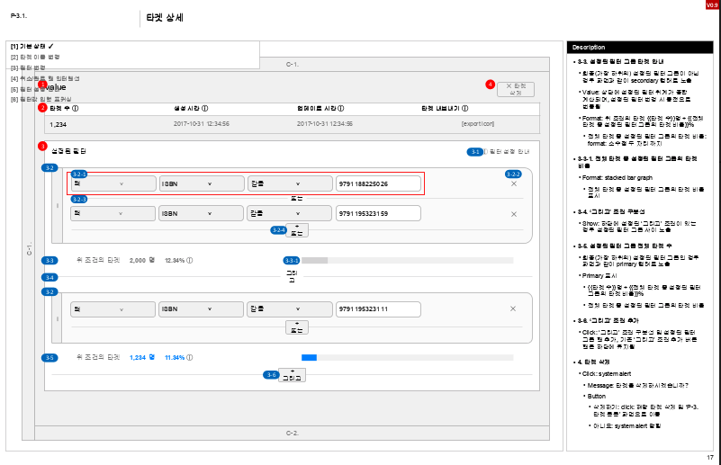
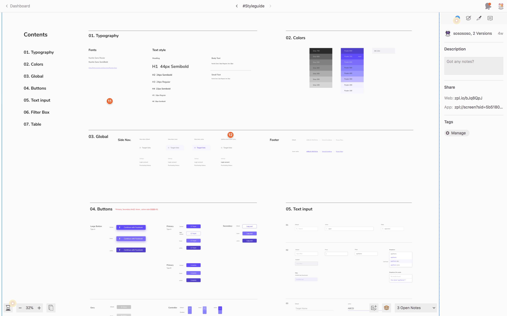
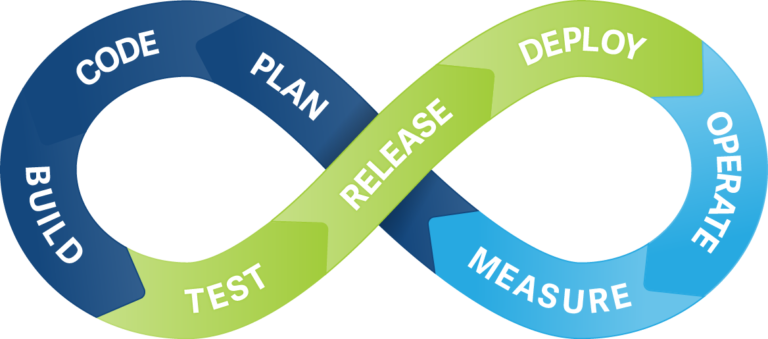

# What we do

## 개발 프로세스
기획 -> 디자인 -> 개발 -> QA -> 배포

## 1. 기획
1. 데이터 구성
	- ex) 페이스북의 친구를 맺지 않으면,
2. 서비스 구성
	- ex) 페이스북의 친구를 맺으면,
3. 데이터 + 서비스 정의 => `무엇`을 만들 것인가?
	- ex) 친구 데이터를 모아서, 친구들 간의 교류 서비스를 만들자.
4. `무엇`에 대해 세세한 기능 및 용어 정의
> 

## 2. 디자인
#### - 2-1. UX
1. 서비스 기획 분석 => UX 기획
2. Page UI 기획
3. Service Flow 구성
> 

#### 2-2. UI
1. 상세설계와 UX 기획서 분석
2. Style Guide 정리
> 
3. 각각의 기획서 페이지 구성
> 

## 3. 개발
1. 상세설계서와 UI정독/분석하기, 서비스 기획서를 통해 Context 이해하기
2. 디자이너(UX/UI)와 백엔드와 소통 주도하기
	- 디자이너의 구성을 구현하기 위한 제한사항은 없는지?
	- 백엔드 API에서의 제한사항은 없는지?
	- 기타 등등...
3. Component와 Container 그리고, View 나누기
	- Component란?
	- Container란?
	- View란?

## 4. QA
1. PR(Pull Request)를 통한 Code Review하기
2. Production, Develop 버전 분리하여 CI 구성하기
3. Develop에 배포, QA 팀 혹은 CS 팀에서 테스트

## 5. 배포
1. CodeReview와 QA에 문제가 없을 시 LiveServer에 배포
2. 버전관리
2. Bug에 대한 Hotfix사항 관리하기

> 

## References
- [Dan Abramove - Presentational and Container Components](https://medium.com/@dan_abramov/smart-and-dumb-components-7ca2f9a7c7d0)
