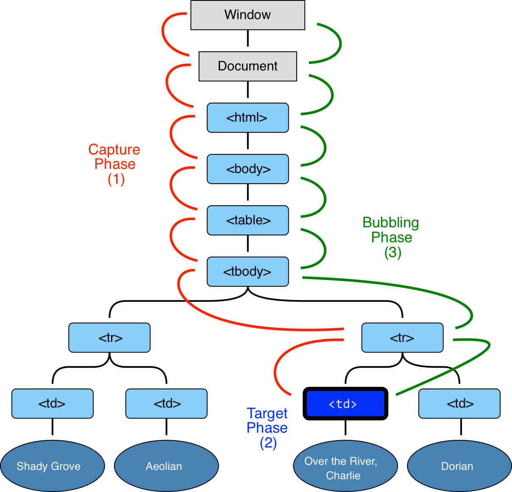

# HTML - Event Propagation, Bubbling And Capturing
이벤트 전파와 Bubbling, Capturing 시간입니다.
해당 파트를 알아가기에 앞서 HTML과 CSS에 대해서 한가지 알고 넘어가도록 하겠습니다.

여러분이 HTML과 CSS를 사용해보셨다면, 기본적으로 우리가 보고 있는 페이지의 구조는 Tree(DOM, CSSOM) 구조로 이루어진다는 것을 알고있으실 것입니다.

간단하게 이해를 돕기 위해 그림과 함께 살펴보겠습니다.

	

위 그림을 통해 우리는 앞으로 HTML과 CSS가 브라우저에 어떻게 렌더링되는지를 간단하게 이해할 수 있었습니다.
즉, DOM tree와 CSSom tree가 결합되어 Rendering tree로 변환되어 우리가 웹에서 보는 다양한 페이지(document)를 볼 수 있는 것이죠.
우리는 브라우저에서 페이지가 이렇게 작동된다는 것을 꼭 알고 계셔야합니다.

그렇다면, Event 전파와 관련된 Bubblng과 Capturing을 설명하기에 앞서 위와 같은 내용을 먼저 설명하는 이유는 무엇일까요?

그것은 바로 Event가 전파된다는 것을 더 쉽게 이해하기 위함입니다. 우리가 들어가기에 앞서 조금만 더 생각해보면 Tree구조에서 Event가 발생되었을 때, 해당 Event가 어디서 발생되었는지 혹은 어디까지 전파해야할지를 정의해야 할 필요가 있다는 생각을 가질 수 있다면 아주 👍 입니다. 👏

이러한 생각을 가지고 Event Propagation에 대한 Bubbling과 Capturing에 대해서 알아봅시다.

---
# Event Propagation
예제를 살펴보며 간단하게 Event 전파에 대해 알아보겠습니다.

> Event Propagation Example

우리는 `
`에 Event Handler(이상 Event)를 할당하였지만, 우리가 `<em>` 또는 `<code>`를 클릭하면 해당 Event를 볼 수 있습니다.

조금 이상하게 느낄 수 있습니다. 분명 `<em>` 또는 `<code>`를 클릭하였는데, 왜 `
`의 Event가 실행이 되는 것일까요?

이러한 현상들을 `Event Propagation`라고 정의하며 이에 관련하여 Bubbling과 Capturing이라는 표현을 사용합니다. 이제 Bubbling과 Capturingd에 대해서 더 자세히 알아보겠습니다.

---
## Bubbling
버블링은 이름에서도 알 수 있듯이 버블링이라는 의미는 아주 간단합니다. 간단히 예제를 살펴보겠습니다.

> Bubbling Example

예제에서는, `FORM > DIV > P` 순서대로 중첩된 Element와 Event를 구성하였습니다.

1. 우리가 `
` 내부를 클릭하면, 처음으로 `
`의 `onclick` 이벤트가 실행됩니다.
2. 다음에는 외부에 있는 `
`의 `onclick` 이벤트.
3. 다음에는 외부에 있는 `<form>`의 `onclick` 이벤트.
4. 그리고, 이는 `document`까지 전파될 것입니다.

**Event를 어떠한 하나의 Element에서 발생되면, 첫 Event는 해당 Element에서 실행되고, 이후 부모 Element부터 document까지 전파되어 Event를 각 Element에 Event를 실행시킵니다.**

> Bubbling을 그림으로 보면 아래와 같습니다.

	

이처럼, 이벤트가 위로 끊임없이 전파된다고 하여 Bubbling이라고 합니다.

> ⚠️ 중요한 것은, 대부분의 이벤트는 Bubbling이 발생됩니다. 대부분이라는 표현을 쓴 이유는 `focus`와 같은 Event는 Bubbling되지 않기 때문입니다.

---
## Stopping bubbling
Bubbling Event는 `event.target`의 Element에서부터 옵니다. 일반적으로 `<html>`, 그런 다음  `document`까지 전파됩니다. 몇몇 이벤트들은 `window`까지 전파되는 경우도 있습니다.
이러한 전파에 존재하는 모든 Event들은 함께 호출 될 것입니다.

하지만, 몇몇 Event는 Bubbling에서 차단해야 하는 경우가 있습니다. Bubbling은 기본 이벤트 속성이므로 Bubbling에 의하여 Event가 실행될 필요가 없을 경우를 대비하기 위함입니다.

이럴 경우에 Bubbling을 차단하는 메소드가 존재하는데, 바로 `event.stopPropagation()`입니다. 그렇다면 `event.stopPropagation()`를 예제로 알아보겠습니다.

> event.stopPropagation() Example

예제를 통해, Event가 상위로 전파되는 것이 방지된다는 것을 보았습니다. 이렇게 StopPropagation을 사용하면 Bubbling을 방지할 수 있습니다.

> ⚠️ event.stropPropagation()과 stopImmediatePropagation()의 차이
- `event.stopPropagation()`은 Event가 전파되는 것을 방지합니다.
- `event.stopImmediatePropagation()`은 다른 계층에 Event가 전파되는 것을 방지하며 추가적으로 어떠한 다른 Event로 부터 Event가 실행되는 것도 방지합니다.

---
## Capturing
Bubbling과는 반대로 작동되는 Event 전파를 `Capturing`이라고 부릅니다. Capturing은 부모로 전파되는 것이 아니라, 부모의 이벤트가 자식들에게 전파되는 것을 의미합니다. 이러한 경우는 흔치 않지만, 가끔 아주 유용하게 사용될 수 있습니다.

이벤트에는 Bubbling, Capturing을 포함하여 3개의 Event 전파 흐름이 있습니다. 이를 `phase`라는 용어를 사용합니다.

1. Capturing phase -- Event가 target Element에서 아래(자식) 방향으로 나아갑니다.
2. Target phase -- Event가 target Element에 있을 경우입니다.
3. Bubbling phase -- Event가 target Element에서 위(부모) 방향으로 나아갑니다.

위와 같은 사항을 그림과 함께 보겠습니다. 우리는 현재 Table Element에서 `<td>`를 클릭하였을 경우에 해당합니다.

	

1. Cpaturing에서 이벤트는 조상(부모)으로부터 전파되어 옵니다(phase 1).
2. 그런 다음에 `event.target`에 도달됩니다(phase 2). 여기서는 `<td>`가 event.target에 해당됩니다.
3. 그런 다음 이것은 다시 부모(조상까지)에게 전파되어 올라갑니다(phase 3).

우리는 이벤트에 Capturing을 주고 싶으면 `addEventListener(event, handler, isCapturing)`이라는 3번째 변수값을 주어야 합니다.
이 변수 값은 default로 false를 가지고 있어 true를 사용한다면, 해당 Event는 이제 Capturing(phase 1)로 사용할 수 있습니다.

>️ ⚠️ 중요한 것은 phase 2의 target event는 분리하여 작동할수는 없습니다. 항상 Bubbling과 Capturing에 의하여 Event가 작동됩니다.

간단하게 예제를 살펴보겠습니다.

> Capturing Example

만약, 우리가 `
`를 클릭한다면, 아래와 같은 결과를 얻을 수 있습니다.
1. `HTML` -> `BODY` -> `FORM` -> `DIV` -> `P` (capturing phase, the first listener), and then:
2. `P` -> `DIV` -> `FORM` -> `BODY` -> `HTML` (bubbling phase, the second listener).

주목할 부분은, `P`는 두번 나타나는데 Capturing이 끝날때와 Bubbling이 시작할 때입니다. `event.eventPhase`의 속성을 통해 현재 Event의 Flow를 알 수 있습니다.(거의 사용하진 않습니다.)

---
## Summary
위에 정리한 내용을 간단하게 요약해보겠습니다.

- Event Propagation
	- 기본적으로 Event는 `event.target`에서 root(document 또는 window)로 전파됩니다(Bubbling).
	- root(document 또는 window)에서 `event.target`으로 Event가 전파될 수 있습니다. 이럴 경우 `addEventListener(document, handler, true)`를 사용해야하며 3번째 변수에 항상 true를 할당해야 합니다.(Capturing)
- Event Properties
	- `event.target` : Event가 실행되었던 근원에 대한 Element를 가르칩니다.
	- `event.currentTarget` : Event가 현재 동작하고 있는 Element를 나타냅니다. 즉, Bubbling 혹은 Capturing되어 이벤트가 부모 혹은 자식으로 전파되었다면 전파되어 Event가 동작하고 있는 Element를 의미합니다.
	- `event.eventPhase`: 현재 이벤트 흐름의 종류를 나타냅니다. (Capturing=1, Target=2, Bubbling=3).
- 이벤트 전파를 방지하기 위해서는 `event.stopPropagation()` 메소드를 사용할 수 있습니다.
- Event는 eventPhase는 3개의 종류가 있지만, target은 독립적으로 실행되는 것이 아니라 이벤트 전파에 의해 실행됩니다.

## References
- [What is DOM?](https://developer.mozilla.org/ko/docs/Gecko_DOM_Reference/%EC%86%8C%EA%B0%9C)
- [javascript-tutorial-en - bubbling and capturing](https://javascript.info/bubbling-and-capturing#bubbling)
- [Rendering tree with DOM and CSS](https://developers.google.com/web/fundamentals/performance/critical-rendering-path/render-tree-construction?hl=ko)
